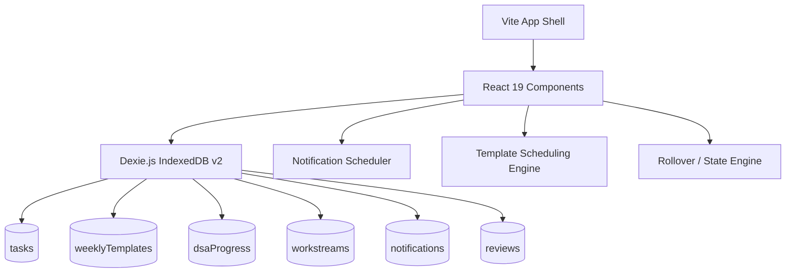

# 🗺️ Tracker — Personal Execution PWA

> **GrindOS** is a mobile-first, offline-first personal execution Progressive Web Application (PWA) designed with a striking **Neo-Brutalist "Blueprint"** aesthetic. It turns goal planning, weekly reviews, and daily habit execution into a high-contrast, structured workflow with zero external dependencies.

---

## 🎨 Design Philosophy: Neo-Brutalist "Blueprint"

GrindOS is designed to look and feel like an interactive architectural sketch or engineer's blueprint:
*   **Grid Paper Layouts:** Vibrant, structural backgrounds with clean graph-paper grids (light theme) and dark inverted graph containers (dark theme / Inverted Vault).
*   **High Contrast:** Solid borders (`2px`/`3px` black borders), sharp box shadows (rigid offset `shadow-md` and pressed effects), and bold modern typography.
*   **Curated Harmonious Color Palette:** Mustard `#FAB95B` (accent), Navy `#1A3263` (base text / dark theme), Muted Teal `#547792`, and crisp signal colors (Red `#E53935` for danger, Green `#4CAF50` for success).
*   **Typography:** Google Fonts pairing: **Space Grotesk** (headings), **DM Sans** (body text), and **JetBrains Mono** (tabular numbers, metrics, code, and badges).

---

## ⚙️ Core Architecture & Tech Stack

Tracker is built to run entirely in the browser, storing all user records locally for offline performance and personal privacy.



### Technical Stack:
1.  **Frontend Core:** React 19 + TypeScript + Vite (Fast HMR compilation).
2.  **Styles:** Vanilla CSS with custom CSS variables (no bloated utility frameworks like Tailwind).
3.  **Local Storage:** **Dexie.js** wrapper for client-side **IndexedDB** databases. Features real-time reactive UI updates via live query hooks.
4.  **Icons:** Lucide React.
5.  **Offline PWA Support:** Native Progressive Web App capabilities for offline installation.

---

## 🚀 Key Features

### 1. The Daily Standup Gate & Carryovers
*   **Confront Your Day:** When opening the app each morning, the *Standup Gate* locks the Today screen, showing you yesterday's carryover statistics and today's schedule. You must review your carries, add targets, and unlock your gate to proceed.
*   **Rollover recap:** Celebrates completed targets and transparently details carryovers.

### 2. 7-Day Widescreen Weekly Planner
*   **Desktop Calendar View:** On screens wider than `1600px`, the **This Week** screen displays all 7 days of the week in a gorgeous **7-column grid layout** side-by-side. 
*   **Compact Two-Row Day Headers:** Day groups automatically adapt their headers into a structured two-row layout in narrow columns, displaying day name, date, TODAY badges, and execution fractions cleanly.
*   **Self-Healing Column Cards:** Cards use `align-items: start` to occupy only their natural vertical contents. Monday will be compact while Tuesday expands, completely eliminating awkward white spaces.

### 3. Weekly Templates & Auto-Scheduling
*   **Define Once, Schedule Weekly:** Create recurring weekly schedules (e.g., Standups, Gym blocks, Study sessions) or daily habits.
*   **Auto-Generation:** Every Monday (or upon first app launch of a new week), the background scheduler auto-generates real `PLANNED` tasks for the whole week from your templates.
*   **Instant UI Sync:** Toggling templates or adding a new template immediately triggers scheduling for the current week, giving you instant visual feedback on your calendar.

### 4. The Vault (Backlog & DSA Tracker)
*   **Deferred Backlog:** Send temporary tasks to **The Vault** to maintain a clean daily focus.
*   **DSA Progress Tracker:** A categorized DSA checklist representing progressive study phases.
*   **DSA Auto-Linking:** Link a template to the DSA tracker. The template engine will automatically query your IndexedDB, find the next uncompleted lecture, and populate a scheduled daily coding task with that specific topic!
*   **DSA Timer:** Built-in Pomodoro/Focus stopwatch directly inside task details.

### 5. Automated Rollover & Debt Tracker
*   **4 AM Rollover:** The system runs a background date rollover at 4:00 AM each day. Any uncompleted tasks are automatically rolled over to the next day, and their `rolloverCount` is incremented.
*   **Carryover Debt Banner:** If you carry over tasks too many times, a red **ROLLOVER DEBT** warning banner flashes on your dashboard to encourage focus and scope reduction.

### 6. Guided Weekly Review Stepper
*   **Guided Reflection:** Reflect on your week through a custom stepper:
    *   **Stage 1:** Celebrate completed wins.
    *   **Stage 2:** Address challenges and missed targets.
    *   **Stage 3:** Set next week's core focus.
*   **Stepping Completion:** Celebrates your reflection loop with full-screen confetti!
*   **Log Archives:** Past reviews are saved locally and are browsable in Settings at any time.

---

## 💾 IndexedDB Schema (Dexie.js v2)

GrindOS stores its data across 6 transactional database tables:

| Table | Index Fields | Description |
|---|---|---|
| `tasks` | `id, plannedFor, status, workstreamId, source, sortOrder` | Stores all manual, template, and rollover tasks. |
| `weeklyTemplates` | `id, workstreamId, active, sortOrder` | Stores recurring daily and weekly templates. |
| `dsaProgress` | `lectureId, completedAt` | Tracks completed DSA syllabus topics. |
| `workstreams` | `id, name, active, sortOrder` | Grouping categories (Work, DSA, Study, Personal, etc.). |
| `notifications` | `id, kind, enabled` | Configured timings for standup, EOD, and weekly reflections. |
| `reviews` | `id, weekStart, weekEnd` | Saved guided reflection logs. |

---

## 🛠️ Getting Started & Development

### Installation

Clone the repository and install the dependencies:
```bash
# Clone the repository
git clone <repository-url>
cd Tracker

# Install dependencies
npm install
```

### Running Locally

To launch the Vite development server in normal local-only mode:
```bash
npm run dev
```

### Running on your Local Network (for Mobile Testing)

To expose the development server on your local network so you can open and test the PWA from your mobile device:
```bash
npm run dev -- --host
```
This will print a local network URL, e.g.:
```text
  ➜  Local:   http://localhost:5173/
  ➜  Network: http://192.168.1.100:5173/
```

### Build & Production Deployment

To compile a clean, production-ready static bundle of the PWA:
```bash
npm run build
```
This outputs a compiled static site in the `/dist` folder, which can be served instantly by any static provider (Netlify, Vercel, GitHub Pages, Firebase Hosting).

### Type Checking & Linting

To run the TypeScript type checker to ensure there are no compilation warnings or errors:
```bash
npx tsc --noEmit
```

---

## 🔒 Privacy & Safety

*   **100% Client-Side:** No accounts, no servers, no logins. All data stays in your browser's local sandbox.
*   **JSON Data Export:** You can export your entire database as a standard JSON backup file or hard-reset all data in the **System Controls** card under Settings.
