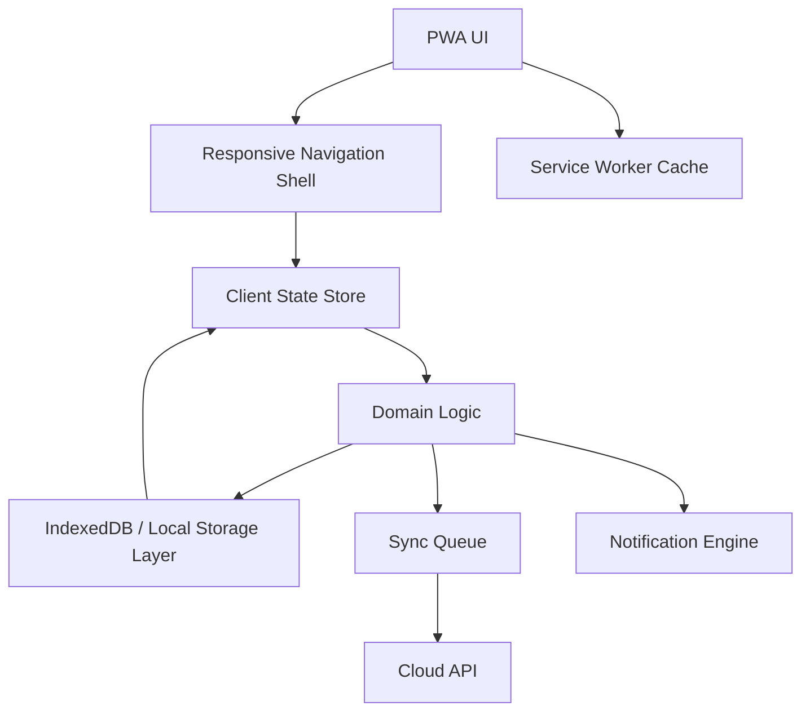

# Architecture

## 1. Architecture Principles

- local-first before cloud-first
- simple domain model before clever automation
- one source of truth for task state
- responsive shell with shared logic across mobile and desktop
- offline behavior must remain useful, not degraded

## 2. High-Level System

## 3. Frontend Structure

Recommended frontend layers:

- `app shell`: route structure, responsive navigation, global chrome
- `screens`: `Today`, `This Week`, `Backlog`, `Weekly Review`, `Settings`
- `components`: task cards, chip tags, progress bars, review cards, empty states
- `domain`: task state transitions, rollover logic, review summaries
- `storage`: local persistence, migrations, sync queue

Suggested UI behavior:

- mobile uses a bottom tab bar
- desktop uses a left rail or persistent sidebar
- the main content stays single-purpose and uncluttered
- bottom-sheet or drawer patterns handle add/edit actions

## 4. Core Data Model

### Task

- `id`
- `title`
- `notes`
- `status` (`backlog`, `planned`, `in_progress`, `done`, `deferred`, `rolled_over`)
- `workstream` (`Work`, `DSA`, `Study`, `Personal`, or custom)
- `priority`
- `dueDate`
- `plannedFor`
- `completedAt`
- `estimate`
- `rolloverCount`
- `tags`
- `source` (`manual`, `review`, `rollover`, `template`)

### Review

- `id`
- `weekStart`
- `weekEnd`
- `summary`
- `wins`
- `misses`
- `debtItems`
- `nextWeekFocus`
- `completedAt`

### Workstream

- `id`
- `name`
- `color`
- `type`
- `active`

### Notification

- `id`
- `kind`
- `schedule`
- `message`
- `enabled`

## 5. State and Sync

### Local State

The app should treat the local database as the primary working layer. The UI reads from local storage and writes to it immediately, then syncs later if cloud support is enabled.

### Sync Strategy

- queue writes locally first
- synchronize in the background when online
- store last sync metadata
- allow a manual sync trigger
- prefer last-write-wins only for truly simple fields
- preserve audit data for rollover and review history

### Conflict Handling

The simplest safe approach for v1 is:

- local edit wins for the current session
- conflict markers for important fields
- manual resolution for review summaries and debt items

## 6. Offline Strategy

- cache the app shell with a service worker
- keep essential data accessible without network
- support full read/write while offline
- queue sync operations until connection returns
- show sync status clearly but not intrusively

## 7. Notification System

Notifications should support:

- daily standup reminder
- end-of-day check-in
- weekly review reminder
- rollover or debt attention prompts

Keep notifications soft and useful. The app should guide the user without becoming noisy.

## 8. Security and Privacy

- treat data as personal and sensitive
- minimize cloud reliance
- encrypt in transit when syncing
- keep auth simple for the first version
- avoid collecting unnecessary metadata

## 9. Extensibility

The architecture should leave room for:

- recurring tasks
- templates
- goal tracking
- statistics and trend charts
- study-specific modules
- optional AI-assisted task grouping

## 10. Recommended Implementation Order

1. build the local data model
2. wire the responsive shell and navigation
3. implement `Today` and `This Week`
4. add rollover and weekly review
5. add offline persistence
6. add notifications
7. add sync and conflict handling