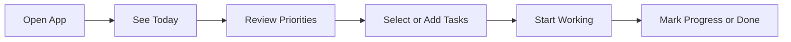
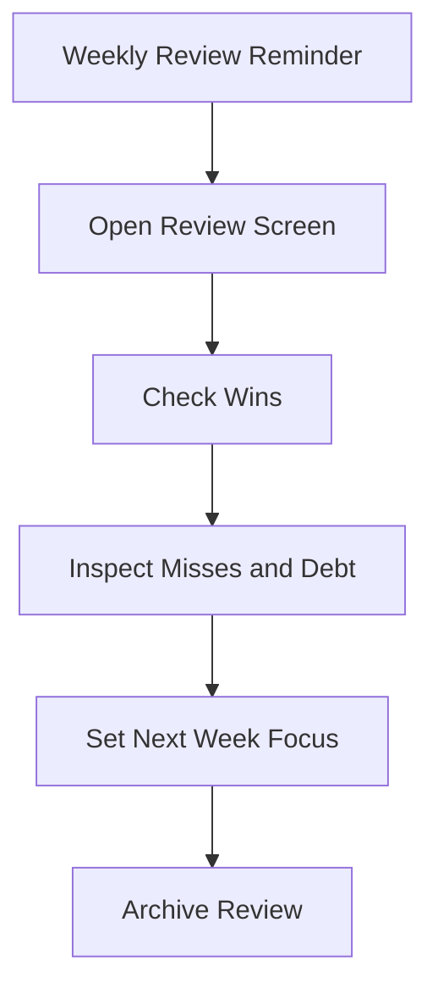

# User Flows

## 1. Daily Start Flow

Steps:

- user opens the app
- the app lands on `Today`
- the app shows the current date, top priorities, and unfinished carryovers
- the user adds or edits items for the day
- the user marks items as in progress or complete

## 2. Add or Edit Task Flow

- open quick add from any screen
- enter title and optional details
- choose workstream, priority, and target time period
- save into `Today`, `This Week`, or `Backlog`
- return to the current screen without losing context

## 3. Rollover / Debt Flow

- task remains unfinished at end of day or end of week
- app marks it as rollover debt
- user decides whether to keep, defer, split, or drop it
- rolled work appears in the next planning view
- rollover count or debt state stays visible

## 4. Weekly Review Flow

Steps:

- app prompts the user at the end of the week
- user reviews wins, misses, and rollover debt
- user selects the top priorities for next week
- user archives the review
- the next week starts from a cleaner baseline

## 5. DSA / Study Flow

- user opens a study workstream
- app shows current lesson, topic, or problem set
- user logs progress for the session
- completed material is archived into the study history
- unfinished material rolls into the next session

## 6. Offline Recovery Flow

- user creates or edits items while offline
- local database records changes immediately
- app shows offline status clearly
- sync queue flushes when the device reconnects
- any conflicts are surfaced with a simple resolution path

## 7. Settings and Maintenance Flow

- user opens settings from the navigation shell
- user configures notifications, workstreams, and sync behavior
- user optionally exports or backs up data
- user can reset a broken preference without losing task history